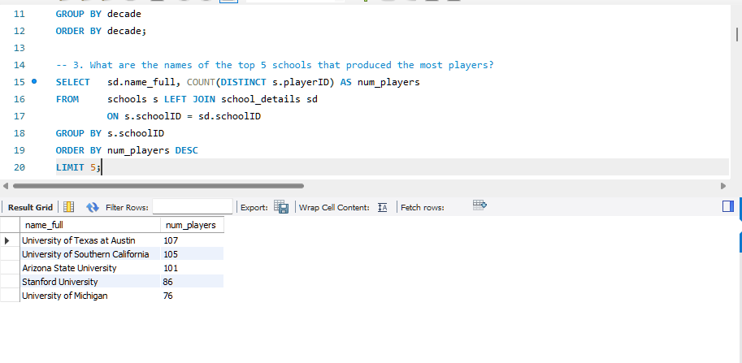
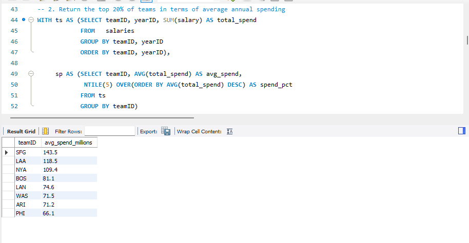
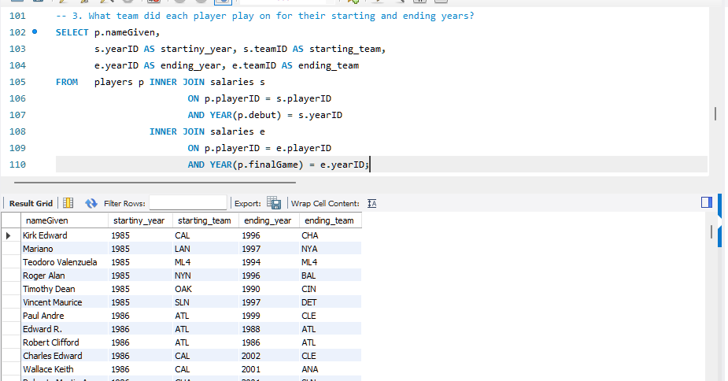
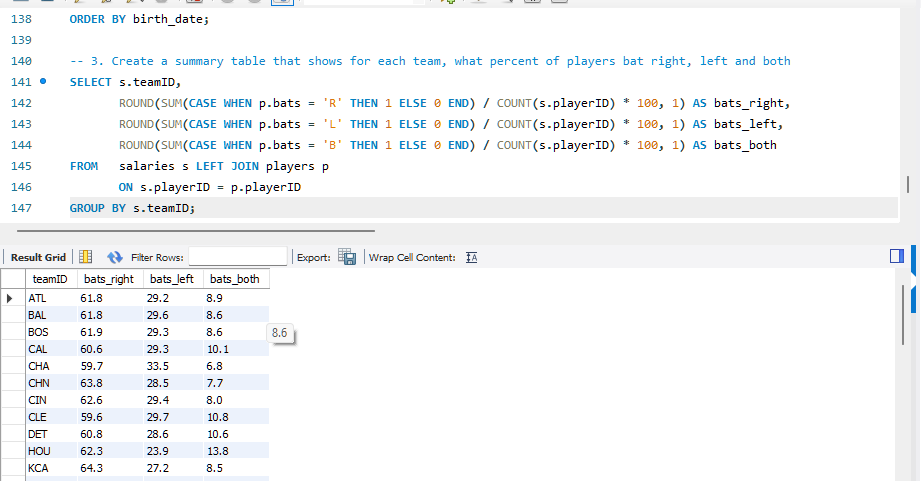

# baseball-analytics-with-sql
Analyzing baseball data with MySQL to explore schools, team salaries, player careers, and player characteristics.

# Baseball Analytics with SQL

## Project Overview

This project explores historical baseball data using SQL to investigate four areas of baseball analytics:

- **School Analysis** — examining schools that produced professional baseball players.
- **Salary Analysis** — analyzing team spending and cumulative salary expenditure over time.
- **Player Career Analysis** — examining player age, career length, and team history.
- **Player Comparison Analysis** — comparing player characteristics and identifying trends over time.

The project demonstrates how SQL can be used to explore relational data, perform multi-step analysis, and answer analytical questions using MySQL.

## Tools Used

- MySQL
- SQL
- MySQL Workbench

## Database Tables

The analysis uses several related tables, including:

- `schools`
- `school_details`
- `salaries`
- `players`

---

## 1. School Analysis

This analysis examines the schools associated with professional baseball players.

### Questions explored

- How many schools produced players in each decade?
- Which five schools produced the most players?
- Which three schools produced the most players in each decade?

### Key finding

Among the top five schools, the University of Texas at Austin produced the most players with **107**, followed by the University of Southern California with **105**.

### SQL techniques

- `LEFT JOIN`
- `GROUP BY`
- `COUNT(DISTINCT)`
- Common Table Expressions (CTEs)
- `ROW_NUMBER()`
- Aggregation and ranking

### Result

---

## 2. Salary Analysis

This analysis examines team salary spending and cumulative expenditure over time.

### Questions explored

- Which teams were in the top 20% based on average annual spending?
- What was each team's cumulative spending over the years?
- In which year did each team's cumulative spending first exceed $1 billion?

### Key finding

Among the teams in the top 20% by average annual spending, **SFG** had the highest average annual spending at approximately **$143.5 million**, followed by **LAA at $118.5 million** and **NYA at $109.4 million**.

### SQL techniques

- Common Table Expressions (CTEs)
- `SUM()`
- `AVG()`
- Window functions
- `NTILE()`
- Running totals
- `ROW_NUMBER()`

### Result

---

## 3. Player Career Analysis

This analysis examines player careers using biographical and salary data.

### Questions explored

- How many players are in the dataset?
- How old were players when they began and ended their careers?
- How long did their careers last?
- Which teams did players play for in their starting and ending years?
- Which players started and ended with the same team while playing for more than a decade?

### SQL techniques

- `INNER JOIN`
- Date conversion
- `TIMESTAMPDIFF()`
- Date calculations
- Filtering and sorting

### Result

---

## 4. Player Comparison Analysis

This analysis compares player characteristics and examines changes over time.

### Questions explored

- Which players shared the same birthday?
- What percentage of players on each team batted right-handed, left-handed, or both?
- How did average player height and weight at debut change across decades?

### SQL techniques

- Common Table Expressions (CTEs)
- `CASE`
- Conditional aggregation
- `GROUP_CONCAT()`
- `LAG()`
- Window functions
- Date functions

### Result

---

## SQL Skills Demonstrated

This project provided practical experience working with:

- Joins
- Aggregate functions
- Common Table Expressions
- Window functions
- `ROW_NUMBER()`
- `NTILE()`
- `LAG()`
- Conditional aggregation with `CASE`
- Date parsing and conversion
- Date calculations
- Running totals
- Ranking and comparison
- Data filtering and ordering

## Project Takeaway

This project strengthened my ability to use SQL to explore relational data, perform multi-step analysis, and apply analytical SQL techniques to answer different types of questions.

It also provided practical experience working across multiple related datasets rather than analyzing a single table in isolation.
